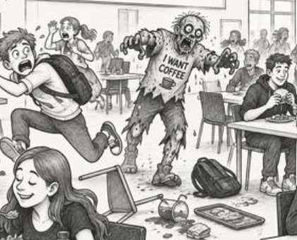

# Zombie Logistic Regression
Learn about <i>Logistic Regression</i> with a <i>Zombie</i> game in Flask. 
 
&nbsp;&nbsp;&nbsp;&nbsp;&nbsp; 
 
You have received a new robot.  And you have now completed initialization test on the robot.  Your test indicate that the robot can work alone. 
<i>So far, so good...</i> 
 
(Sadly) You naively let the robot work alone in the basement.  
Nobody told your team what robo-7 is actually working with. 
... 
Deep underneath the building is a secret laboratory containing a collection of experimental viruses. 
 
Your robot drops a can of experimental viruses, and 
the <i>Zombie Apocalypse</i> begins. 
&nbsp;&nbsp;&nbsp;&nbsp;&nbsp; 
Logistic regression to the rescue. 
 
But with a stroke of good luck, we have your survival tool ready: Logistic regression! 
 
We have trained a model on <i>zombie apocalypse survival</i> data,  
and its accuracy on the test data was 54.2%... (Great, not)... 
Which allows us to calculate your chances of survival. 

Let's see what your odds are. 
