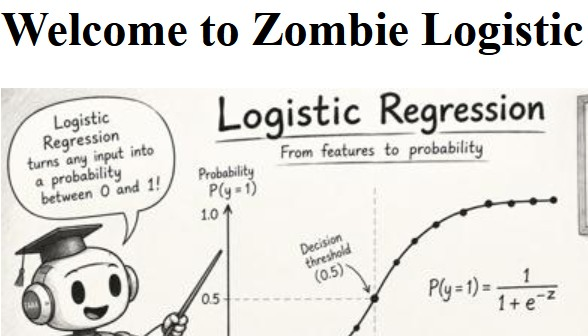

# Zombie Logistic Regression
Learn about <i>Logistic Regression</i> with a <i>Zombie</i> game in Flask. 
 
&nbsp;&nbsp;&nbsp;&nbsp;&nbsp; 
 
You have received a new robot.  You have now completed initialization test on the robot.  Your test indicate that the robot can work alone. 
 
You naively let the robot work alone in the basement.  
Nobody told your team what robo-7 is actually working with. 
 
Deep underneath the building is a secret laboratory containing a collection of experimental viruses. 
 
But with a stroke of good luck, we have your survival tool ready: logistic regression! 
We trained the model on zombie apocalypse survival data, and its accuracy on the test data was 54.2%. Let's see what your odds are. 
